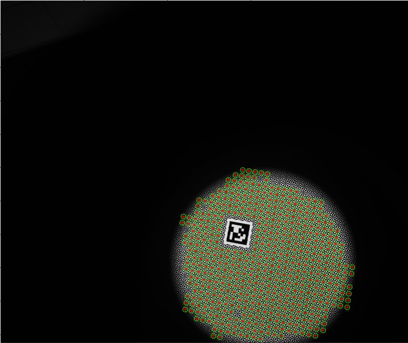
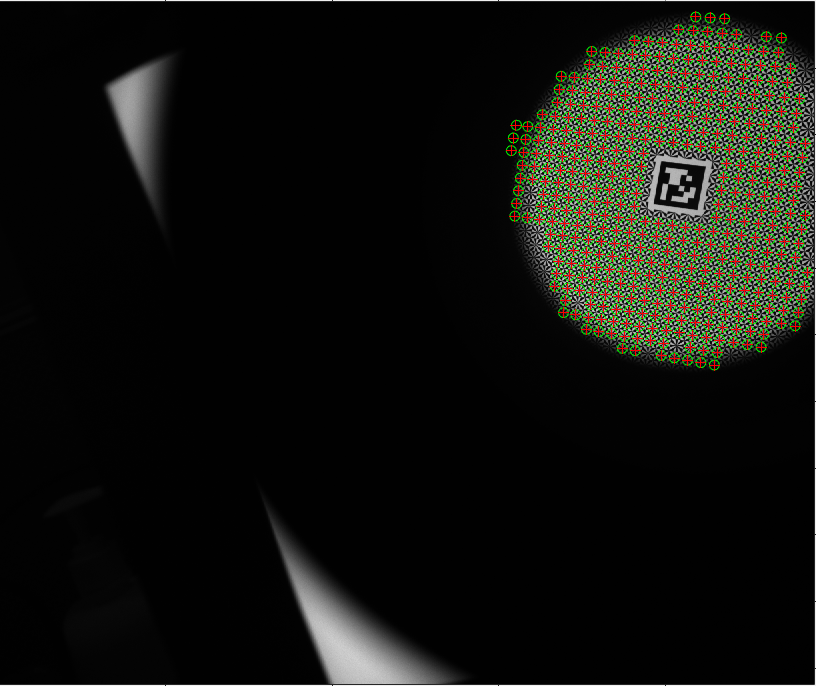
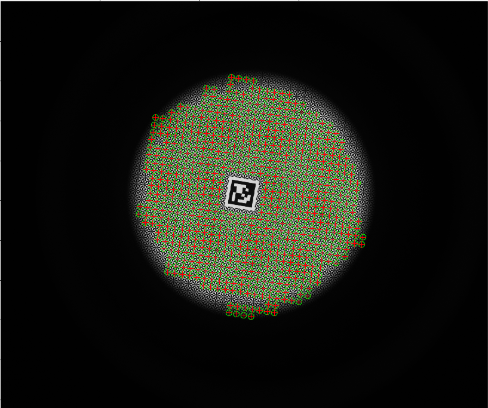

## Camera Calibration using a Collimator System

**This is a demo for the paper: Camera Calibration using a Collimator System. This demo shows demonstration of calibrating a camera using several collimator images. ** 

## Data

**The demo contains raw data ( including images and text ) and MATLAB code. **

**The raw collimator images is in the folder `data/data1`. In a `.txt`, the first two columns are 2D image points `(x,y)`, and the third and fourth column are 3D points of the calibration target with `z=0`.**

## Usage

**The demo code is tested on MATLAB R2021b** 

**Run demo: `demo_coll_calib.m`** 

## Note

**The complete CPP version source code will be released.**
